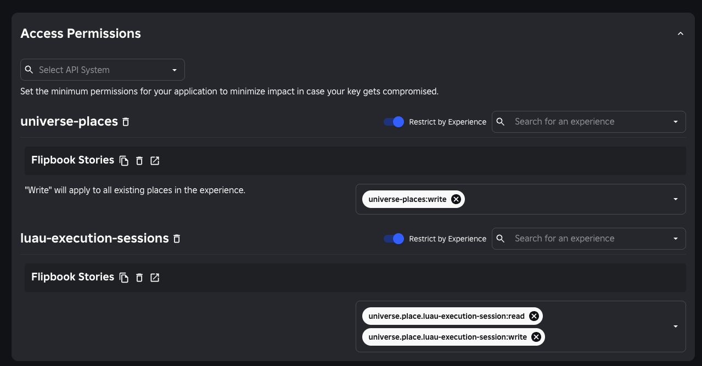

# flipbook-cli

Deploy [Flipbook](https://github.com/flipbook-labs/flipbook) storybook experiences to Roblox via Open Cloud.

## Installation

```sh
rokit add flipbook-labs/flipbook-cli
```

## Setup

1. Create a Roblox **experience** in Creator Hub.
2. Copy the **universe ID** and the **start place ID** (the place created with the experience, or your chosen root place).
3. Enable **Allow Copying** on the start place if you will create per-PR preview places (`CreatePlaceAsync` clones from it).
4. Create an Open Cloud API key. Pass it with `--api-key`, set `ROBLOX_API_KEY`, or store it as a GitHub Actions secret for workflows.

The universe and target place are passed per command via `--universe-id` and (optionally) `--place-id`.

API key access permissions:

- `universe-places:write`
- `universe.place.luau-execution-session:read`
- `universe.place.luau-execution-session:write`

When configuring the key, restrict both API systems by experience and select your storybook experience. The screenshot below is only an example of the required permissions:



## Commands

### `deploy`

Publish a pre-built `.rbxl` place file to a named place in your universe, then inject the Flipbook runtime. The place is resolved by name, or created if it does not exist yet.

```sh
flipbook-cli deploy --universe-id 123 --place-name "Flipbook Stories" --place-file out.rbxl
flipbook-cli deploy --universe-id 123 --place-name "Flipbook Stories 123" --place-file out.rbxl
```

| Flag              | Description                                                                                 |
| ----------------- | ------------------------------------------------------------------------------------------- |
| `--place-name`    | **Required.** Name of the place to update or create for this deployment.                     |
| `--universe-id`   | **Required.** Universe to deploy to.                                                         |
| `--place-file`    | **Required.** Path to an `.rbxl` place file containing your storybooks and stories.          |
| `--api-key`       | Roblox API key. Falls back to the `ROBLOX_API_KEY` env var.                                  |
| `--place-id`      | Publish to a specific place ID instead of resolving by name. Disambiguates same-named places. |
| `--flipbook-rbxm` | Path to a local `Flipbook.rbxm` to use as the runtime. Defaults to the latest GitHub release. |

Each deploy:

- resolves `--place-name` to a place in the universe (creating it via `CreatePlaceAsync` from the start place if needed),
- publishes `--place-file` to that place, and
- injects `ReplicatedStorage.Flipbook` from the latest [GitHub release](https://github.com/flipbook-labs/flipbook/releases) (or `--flipbook-rbxm`), downloaded to `system.tmpdir()/flipbook-cli/`.

`ReplicatedStorage.Stories` (and the rest of the storybook) comes from whatever is in `--place-file`. Place lookup uses Roblox as the source of truth (by place name). No local place registry.

### `comment`

Post or update the storybook preview comment on a pull request. Resolves the place by name (same as deploy) to build the preview link.

```sh
flipbook-cli comment --pr 123 --universe-id 123 --place-name "Flipbook Stories 123"
```

| Flag                  | Description                                                          |
| --------------------- | ------------------------------------------------------------------ |
| `--pr`                | **Required.** Pull request number to comment on.                    |
| `--universe-id`       | **Required.** Universe the preview place lives in.                  |
| `--place-name`        | **Required.** Name of the deployed preview place.                  |
| `--api-key`           | Roblox API key. Falls back to the `ROBLOX_API_KEY` env var.        |
| `--github-token`      | GitHub token. Falls back to the `GITHUB_TOKEN` env var.            |
| `--github-repository` | `owner/repo`. Falls back to the `GITHUB_REPOSITORY` env var.       |

## Releasing

Releases are handled by [changewrite](https://github.com/flipbook-labs/changewrite),
which bundles the full release lifecycle (gate, draft, attach, publish, and the
version-bump PR) into a single GitHub Action. The release workflow
([`.github/workflows/release.yml`](.github/workflows/release.yml)) builds the
cross-platform binaries, then hands the version source ([`changewrite.toml`](changewrite.toml),
mirrored to `loom.config.luau`) to the action, which attaches the binaries to the draft release via a
`post-draft-hook`.

## Environment variables

| Variable            | Description                                                          |
| ------------------- | ------------------------------------------------------------------- |
| `ROBLOX_API_KEY`    | Open Cloud API key; fallback for `--api-key` on every command        |
| `GITHUB_TOKEN`      | GitHub API auth for the Flipbook release fetch and `comment`         |
| `GITHUB_REPOSITORY` | `owner/repo`; fallback for `--github-repository` on `comment`        |

The `deploy` command also honors the `FLIPBOOK_ROJO_CMD` override for the `rojo` executable path (defaults to `rojo`).
